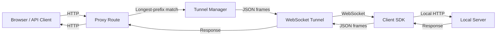
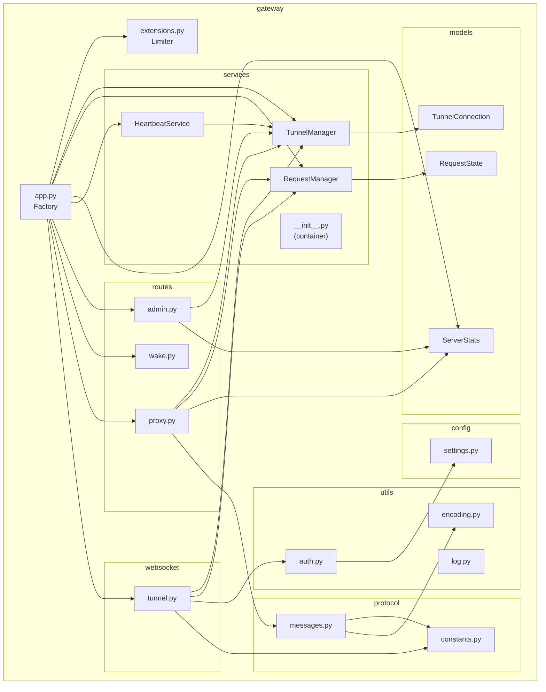

# Architecture

## High-Level Design

Tunnel Gateway is a reverse-proxy relay built on Flask. Public HTTP traffic arrives at the proxy route, is serialized into JSON frames, and forwarded over a persistent WebSocket connection to a client SDK running alongside the user's local server. The response travels the same path in reverse.



## Component Diagram



## Dependency Flow

Dependencies flow strictly downward — no circular imports exist.

```
config/settings.py          ← No internal imports
protocol/constants.py       ← No internal imports
utils/encoding.py           ← No internal imports
utils/log.py                ← Imports config
utils/auth.py               ← Imports config
protocol/messages.py        ← Imports protocol.constants, utils.encoding
models/tunnel.py            ← Imports utils.log
models/request.py           ← Imports utils.encoding
models/stats.py             ← No internal imports
services/tunnel_manager.py  ← Imports models.tunnel, utils.log
services/request_manager.py ← Imports models.request, utils.log
services/heartbeat.py       ← Imports config, protocol.messages, utils.log
routes/*                    ← Imports services, config, protocol, utils
websocket/tunnel.py         ← Imports services, config, protocol, utils
extensions.py               ← Imports config
app.py                      ← Imports everything (deferred blueprint imports)
main.py                     ← Imports app
```

## State Management

All mutable state is encapsulated in three service singletons, instantiated by the app factory and published to the `gateway.services` container module.

| Service | Class | Responsibility |
|---------|-------|----------------|
| `svc.tunnel_manager` | `TunnelManager` | Thread-safe tunnel registry |
| `svc.request_manager` | `RequestManager` | Thread-safe pending request registry |
| `svc.server_stats` | `ServerStats` | Thread-safe aggregate counters |

Any module accesses services via:

```python
from gateway import services as svc
svc.tunnel_manager.find_longest_match(path)
```

## Thread Safety Model

| Resource | Lock Strategy | Owner |
|----------|---------------|-------|
| Tunnel registry | Internal `threading.Lock` in `TunnelManager` | TunnelManager |
| Pending requests | Internal `threading.Lock` in `RequestManager` | RequestManager |
| Server stats | Internal `threading.Lock` in `ServerStats` | ServerStats |
| Per-tunnel WS send | `send_lock` on `TunnelConnection` | TunnelConnection.send() |
| Async message queue | Thread-safe `collections.deque` | TunnelConnection |

*Note: The WebSocket multiplexing utilizes a `ThreadPoolExecutor` (max 50 workers) to ensure high concurrency without blocking the main event loop. Prometheus metrics are collected via `prometheus_client` and exposed via the `/metrics` endpoint.*

## App Factory Pattern

`gateway.app.create_app()` follows the standard Flask factory pattern:

1. Create `Flask(__name__)`
2. Initialize extensions (`Sock`, `Limiter`)
3. Instantiate services → publish to `gateway.services`
4. Register HTTP blueprints (admin, wake, proxy)
5. Register WebSocket handler via `register_tunnel_handler(sock)`
6. Start `HeartbeatService` background worker
7. Return the configured app

## Environment Variables

| Variable | Default | Description |
|----------|---------|-------------|
| `HOST` | `0.0.0.0` | Server bind address |
| `PORT` | `5000` | Server bind port |
| `TUNNEL_TIMEOUT` | `30.0` | Seconds to wait for tunnel response |
| `PING_INTERVAL` | `15` | Seconds between heartbeat pings |
| `PING_TIMEOUT` | `45` | Seconds of inactivity before reaping |
| `TUNNEL_API_KEY` | *(required)* | Secret API key for tunnel client authentication (loaded from `gateway/config/.env`) |
| `STREAMING_THRESHOLD_BYTES` | `1048576` (1 MB) | Body size above which streaming mode is used |
| `CHUNK_SIZE` | `32768` (32 KB) | Chunk size for streaming reads |
| `RATE_LIMIT_DEFAULT` | `500 per minute` | Default rate limit for all endpoints |

## Cleanup & Timeout Behaviour

### Request Cleanup

Every proxy request guarantees cleanup via a `do_cleanup()` closure:

- For **single-message** responses or errors, cleanup runs in the `finally` block of the proxy route.
- For **streaming** responses, cleanup runs in the `finally` block of the response generator (after the last chunk is yielded or on timeout).

Cleanup performs:
1. Remove the request from `RequestManager`
2. Compute latency
3. Record end-of-request stats in `ServerStats`

### Tunnel Cleanup

Tunnels are cleaned up in three scenarios:

1. **Graceful disconnect** — `ws.receive()` returns `None`; the `finally` block in the multiplexer calls `tunnel_manager.unregister()`.
2. **Exception** — Any exception in the multiplexer loop triggers the same `finally` block.
3. **Heartbeat timeout** — The `HeartbeatService` reaps tunnels whose `last_active` exceeds `PING_TIMEOUT`.

The `unregister()` method verifies WebSocket ownership to prevent a race where a new tunnel re-registers the same path before the old one's `finally` block executes.
