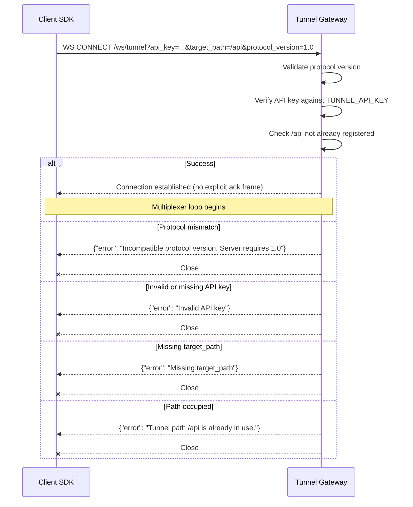
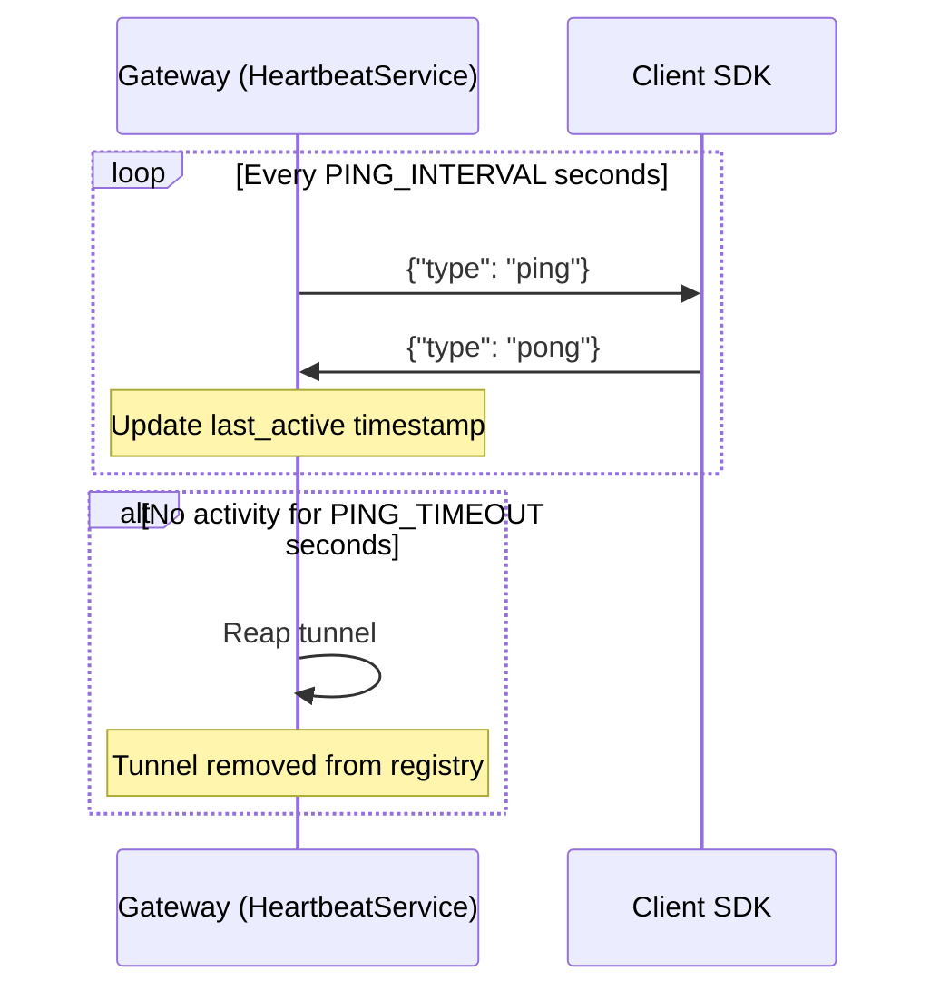
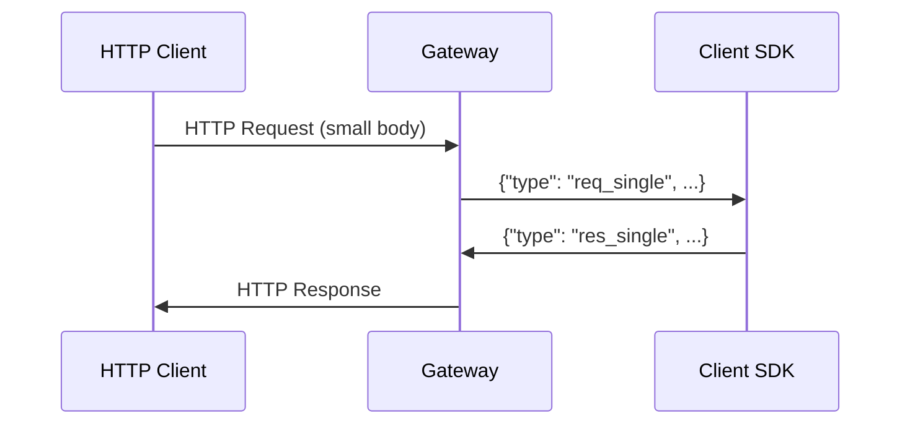
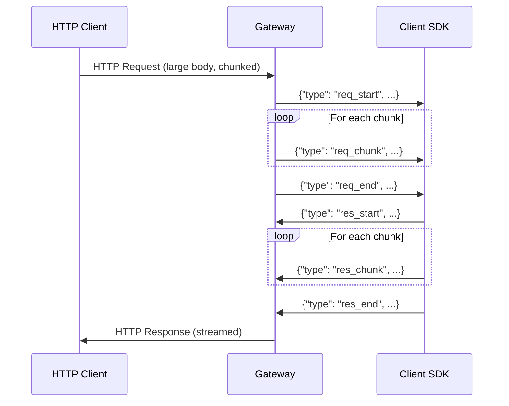
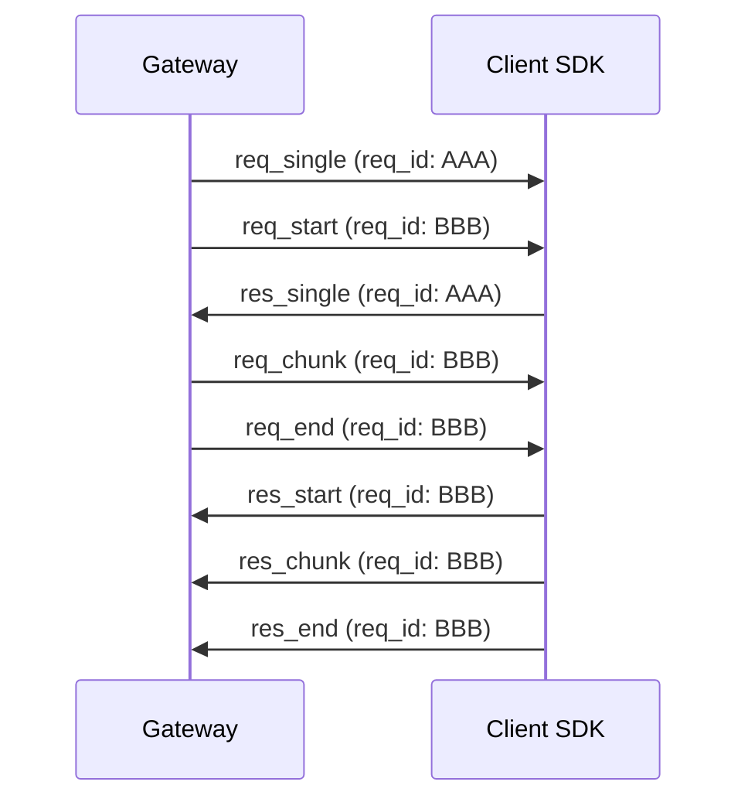

# Protocol Specification

## Protocol Version

Current protocol version: **`1.0`**

The client must include `protocol_version=1.0` as a query parameter when connecting to `/ws/tunnel`. The server rejects connections with a mismatched or missing version.

---

## Tunnel Registration

### Connection

```
WS /ws/tunnel?api_key=<key>&target_path=<path>&protocol_version=1.0
```

| Parameter | Required | Description |
|-----------|----------|-------------|
| `api_key` | Yes | Secret API key matching the server's configured `TUNNEL_API_KEY` |
| `target_path` | Yes | URL path prefix this tunnel will serve |
| `protocol_version` | Yes | Must match server's `PROTOCOL_VERSION` |

### Registration Sequence



### API Key Verification

The server compares the provided `api_key` query parameter against the `TUNNEL_API_KEY` environment variable using constant-time comparison (`hmac.compare_digest()`) to prevent timing attacks.

---

## Heartbeat System

The server sends periodic `ping` frames to detect dead connections.



### Messages

**Ping** (Server → Client):
```json
{"type": "ping"}
```

**Pong** (Client → Server):
```json
{"type": "pong"}
```

The `last_active` timestamp is updated on **any** incoming message, not just `pong`. This means active request traffic also resets the heartbeat timer.

---

## Request Lifecycle

### Path Matching

The proxy uses **longest-prefix matching** to route requests to tunnels.

Given registered tunnels `/api` and `/api/v2`:
- `GET /api/users` → matches `/api`
- `GET /api/v2/users` → matches `/api/v2`
- `GET /other` → 404 (no matching tunnel)

### Subpath Computation

After matching, the matched prefix is stripped to compute the `subpath`:

```
Request:  GET /api/v2/users?page=1
Match:    /api/v2
Subpath:  /users
Query:    page=1
```

The subpath always starts with `/`.

### Protocol Selection

The gateway automatically selects the protocol based on request characteristics:

| Condition | Protocol |
|-----------|----------|
| `Content-Length` ≤ `STREAMING_THRESHOLD_BYTES` | Single-message |
| `Content-Length` > `STREAMING_THRESHOLD_BYTES` | Streaming |
| `Transfer-Encoding: chunked` | Streaming |
| No body | Single-message |

---

## Single-Message Protocol

Used for small requests/responses. The entire payload fits in one WebSocket frame.



### Request Frame

**`req_single`** (Server → Client):

```json
{
  "type": "req_single",
  "req_id": "550e8400-e29b-41d4-a716-446655440000",
  "method": "POST",
  "subpath": "/users",
  "query": "page=1&limit=10",
  "headers": {
    "Content-Type": "application/json",
    "Authorization": "Bearer ..."
  },
  "body": "eyJuYW1lIjogIkpvaG4ifQ=="
}
```

| Field | Type | Description |
|-------|------|-------------|
| `type` | `string` | Always `"req_single"` |
| `req_id` | `string` | UUID v4 — correlates request/response |
| `method` | `string` | HTTP method |
| `subpath` | `string` | Path after the matched tunnel prefix |
| `query` | `string` | Raw query string (without `?`) |
| `headers` | `object` | Request headers (`Host` removed) |
| `body` | `string` | Base64-encoded request body |

### Response Frame

**`res_single`** (Client → Server):

```json
{
  "type": "res_single",
  "req_id": "550e8400-e29b-41d4-a716-446655440000",
  "status": 200,
  "headers": {
    "Content-Type": "application/json"
  },
  "body": "eyJpZCI6IDEsICJuYW1lIjogIkpvaG4ifQ=="
}
```

| Field | Type | Description |
|-------|------|-------------|
| `type` | `string` | Always `"res_single"` |
| `req_id` | `string` | Must match the request's `req_id` |
| `status` | `number` | HTTP status code (default: 200) |
| `headers` | `object` | Response headers |
| `body` | `string` | Base64-encoded response body |

---

## Streaming Protocol

Used for large requests/responses. The body is split into chunks.



### Request Frames

**`req_start`** (Server → Client):

```json
{
  "type": "req_start",
  "req_id": "550e8400-e29b-41d4-a716-446655440000",
  "method": "PUT",
  "subpath": "/upload",
  "query": "",
  "headers": {
    "Content-Type": "application/octet-stream"
  }
}
```

**`req_chunk`** (Server → Client):

```json
{
  "type": "req_chunk",
  "req_id": "550e8400-e29b-41d4-a716-446655440000",
  "data": "base64encodedchunkdata..."
}
```

**`req_end`** (Server → Client):

```json
{
  "type": "req_end",
  "req_id": "550e8400-e29b-41d4-a716-446655440000"
}
```

### Response Frames

**`res_start`** (Client → Server):

```json
{
  "type": "res_start",
  "req_id": "550e8400-e29b-41d4-a716-446655440000",
  "status": 200,
  "headers": {
    "Content-Type": "application/octet-stream"
  }
}
```

**`res_chunk`** (Client → Server):

```json
{
  "type": "res_chunk",
  "req_id": "550e8400-e29b-41d4-a716-446655440000",
  "data": "base64encodedchunkdata..."
}
```

**`res_end`** (Client → Server):

```json
{
  "type": "res_end",
  "req_id": "550e8400-e29b-41d4-a716-446655440000"
}
```

---

## Multiplexing

Multiple requests can be in-flight simultaneously over a single WebSocket connection. Each request is identified by a unique `req_id` (UUID v4).



The multiplexer loop in the WebSocket handler dispatches each incoming frame to the correct `RequestState` by looking up its `req_id` in the `RequestManager`.

---

## Message Type Summary

| Message | Direction | Protocol | Description |
|---------|-----------|----------|-------------|
| `ping` | Server → Client | Heartbeat | Liveness check |
| `pong` | Client → Server | Heartbeat | Liveness acknowledgement |
| `req_single` | Server → Client | Single | Complete request in one frame |
| `res_single` | Client → Server | Single | Complete response in one frame |
| `req_start` | Server → Client | Streaming | Request headers (no body) |
| `req_chunk` | Server → Client | Streaming | Request body chunk |
| `req_end` | Server → Client | Streaming | End of request body |
| `res_start` | Client → Server | Streaming | Response headers (no body) |
| `res_chunk` | Client → Server | Streaming | Response body chunk |
| `res_end` | Client → Server | Streaming | End of response body |

---

## Response Header Filtering

The gateway strips the following headers from tunnel client responses before sending them to the original HTTP caller:

- `Content-Length` — recalculated by Flask/WSGI
- `Transfer-Encoding` — managed by the proxy
- `Content-Encoding` — prevents double-encoding

---

## Admin APIs

### GET /wake

Liveness probe. Rate-limit exempt.

**Response:**
```json
{
  "status": "awake",
  "timestamp": 1735689600
}
```

### GET /admin/status

Server status and active tunnel list. Rate-limit exempt.

**Response:**
```json
{
  "status": "online",
  "uptime_seconds": 3600.00,
  "started_at": 1735686000.0,
  "total_requests": 1500,
  "active_requests": 3,
  "average_latency_ms": 45.23,
  "bytes_uploaded": 1048576,
  "bytes_downloaded": 2097152,
  "total_bytes_transferred": 3145728,
  "active_tunnels_count": 2,
  "tunnels": [
    {
      "target_path": "/api",
      "client_ip": "192.168.1.10",
      "uptime_seconds": 1800.50,
      "requests_served": 750,
      "bytes_uploaded": 524288,
      "bytes_downloaded": 1048576,
      "total_bytes_transferred": 1572864
    }
  ]
}
```

### GET /admin/health

System health metrics. Rate-limit exempt.

**Response:**
```json
{
  "cpu_usage_percent": 12.5,
  "memory_usage_percent": 65.3,
  "used_memory_bytes": 4294967296,
  "total_memory_bytes": 8589934592,
  "thread_count": 8,
  "process_id": 12345,
  "python_thread_count": 6,
  "active_tunnels": 2,
  "active_requests": 3,
  "total_requests": 1500,
  "bytes_uploaded": 1048576,
  "bytes_downloaded": 2097152,
  "average_latency_ms": 45.23,
  "server_uptime_seconds": 3600.00,
  "websocket_tunnel_count": 2
}
```

### GET /admin/info

Server version and capabilities. Rate-limit exempt.

**Response:**
```json
{
  "server_version": "1.0.0",
  "protocol_version": "1.0",
  "python_version": "3.12.0 (main, Oct  2 2024, 00:00:00)",
  "operating_system": "Linux 6.1.0",
  "hostname": "gateway-prod-01",
  "startup_time": 1735686000.0,
  "streaming_support": true,
  "binary_frame_support": false,
  "compression_support": false
}
```

---

## Error Responses

### Proxy Errors

| Status | Condition | Body |
|--------|-----------|------|
| 404 | No tunnel matches the path | `No active tunnel registered for this endpoint.` |
| 504 | Tunnel client didn't respond within `TUNNEL_TIMEOUT` | `Gateway Timeout: The local client did not respond in time.` |
| 502 | Internal error during proxy routing | `Internal gateway error: <details>` |

### WebSocket Registration Errors

All sent as JSON `{"error": "..."}` frames before closing:

| Error Message | Condition |
|---------------|-----------|
| `Incompatible protocol version. Server requires 1.0` | Version mismatch |
| `Invalid API key` | API key missing or invalid |
| `Missing target_path` | Required `target_path` query param missing |
| `Tunnel path /api is already in use.` | Duplicate registration |

---

## Timeout Behaviour

| Timeout | Default | Affects |
|---------|---------|---------|
| `TUNNEL_TIMEOUT` (30s) | Response header wait | Proxy returns 504 if tunnel client doesn't send response headers within this window |
| `TUNNEL_TIMEOUT` (30s) | Streaming chunk wait | Proxy stops streaming if no chunk arrives within this window |
| `PING_TIMEOUT` (45s) | Heartbeat reaper | Tunnels with no activity for this duration are removed |
| `PING_INTERVAL` (15s) | Heartbeat frequency | How often the server sends `ping` frames |
