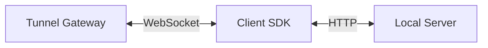
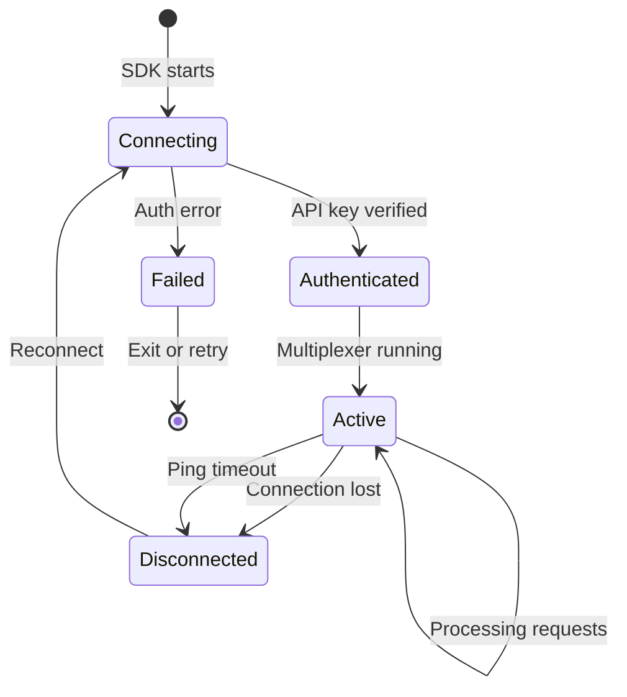

# SDK Integration Guide

This document describes how to build a client SDK that connects to the Tunnel Gateway.

## Overview

A client SDK is responsible for:

1. Establishing a WebSocket connection to the gateway
2. Authenticating with an API key
3. Receiving proxied HTTP requests over the WebSocket
4. Forwarding those requests to a local server
5. Sending responses back through the WebSocket
6. Responding to heartbeat pings



## Connection Lifecycle



## Minimal SDK Implementation

### 1. Connect

```
WebSocket URL: wss://<gateway-host>/ws/tunnel?api_key=<key>&target_path=/myapp&protocol_version=1.0
```

### 2. Handle Incoming Messages

The SDK must handle these message types from the gateway:

| Message Type | Action |
|-------------|--------|
| `ping` | Reply with `{"type": "pong"}` |
| `req_single` | Forward to local server, reply with `res_single` |
| `req_start` | Begin buffering a streaming request |
| `req_chunk` | Append chunk to the streaming request |
| `req_end` | Forward completed request to local server |

### 3. Send Responses

**Single-message response:**
```json
{
  "type": "res_single",
  "req_id": "<from request>",
  "status": 200,
  "headers": {"Content-Type": "application/json"},
  "body": "<base64 encoded>"
}
```

**Streaming response:**
```json
{"type": "res_start", "req_id": "...", "status": 200, "headers": {...}}
{"type": "res_chunk", "req_id": "...", "data": "<base64 chunk>"}
{"type": "res_end", "req_id": "..."}
```

### 4. Multiplexing

The SDK **must** support concurrent requests. Multiple `req_single` or streaming sequences may arrive interleaved, each identified by a unique `req_id`. The SDK should process them in parallel (or at minimum, not block one request while another is in progress).

### 5. Heartbeat

Respond to `{"type": "ping"}` with `{"type": "pong"}` promptly. Failure to respond within `PING_TIMEOUT` (default 45s) causes the gateway to close the connection.

### 6. Reconnection

SDKs should implement automatic reconnection with exponential backoff:

```
attempt 1: wait 1s
attempt 2: wait 2s
attempt 3: wait 4s
attempt 4: wait 8s
...
max wait: 60s
```

Re-register the tunnel after reconnecting — the gateway does not persist tunnel state across disconnections.

## API Key Requirements

The SDK must supply a valid secret API key via the `api_key` query parameter when establishing the WebSocket connection. This key must match the `TUNNEL_API_KEY` configured on the gateway in `gateway/config/.env`.

If an invalid API key is provided, the gateway will send an error frame and close the connection immediately.

## Encoding Convention

All request and response bodies are transferred as **base64-encoded strings** within JSON frames. The SDK must:

- Decode incoming `body` and `data` fields with standard base64
- Encode outgoing `body` and `data` fields with standard base64

## Error Handling

If the gateway sends a frame with `"error"` key at connection time, the connection will be closed. The SDK should log the error and attempt reconnection if appropriate.

```json
{"error": "Invalid API key"}
```

## Response Timeout

The gateway waits `TUNNEL_TIMEOUT` seconds (default 30) for the SDK to send response headers (`res_single` or `res_start`). If the SDK doesn't respond in time, the gateway returns HTTP 504 to the original caller. The request is still valid — the SDK can still send a response, but it will be ignored.

---

## Protocol Versioning

### Current Version: 1.0

The protocol version is negotiated at connection time via the `protocol_version` query parameter. The gateway **rejects** connections with a mismatched version.

### Version Compatibility

| SDK Version | Gateway Version | Compatible |
|-------------|-----------------|------------|
| 1.0 | 1.0 | ✅ |
| 1.0 | 2.0 | ❌ Rejected |
| 2.0 | 1.0 | ❌ Rejected |

Future protocol versions will be documented with migration guides.

### Breaking vs Non-Breaking Changes

- **Non-breaking**: Adding optional fields to existing message types, adding new admin endpoints
- **Breaking**: Changing message type names, changing encoding format, modifying the handshake, removing fields — these require a version bump

---

## Future Roadmap

### Planned Capabilities

| Feature | Status | Description |
|---------|--------|-------------|
| Binary frame support | Planned | Send raw binary WebSocket frames instead of base64-in-JSON |
| Compression | Planned | Per-message WebSocket compression (permessage-deflate) |
| Multi-region failover | Planned | Automatic failover between gateway instances |
| Connection resumption | Planned | Resume tunnels after brief disconnections without re-auth |
| Metrics export | Planned | Prometheus-compatible `/metrics` endpoint |
| Admin authentication | Planned | Protect admin endpoints with API keys |
| Custom rate limits | Planned | Per-tunnel rate limiting configuration |
| WebSocket binary frames | Planned | Native binary transfer without base64 overhead |

### Deprecation Policy

- Deprecated features will be announced at least one minor version before removal
- Protocol version bumps will include migration documentation
- SDK compatibility matrices will be maintained in this document
